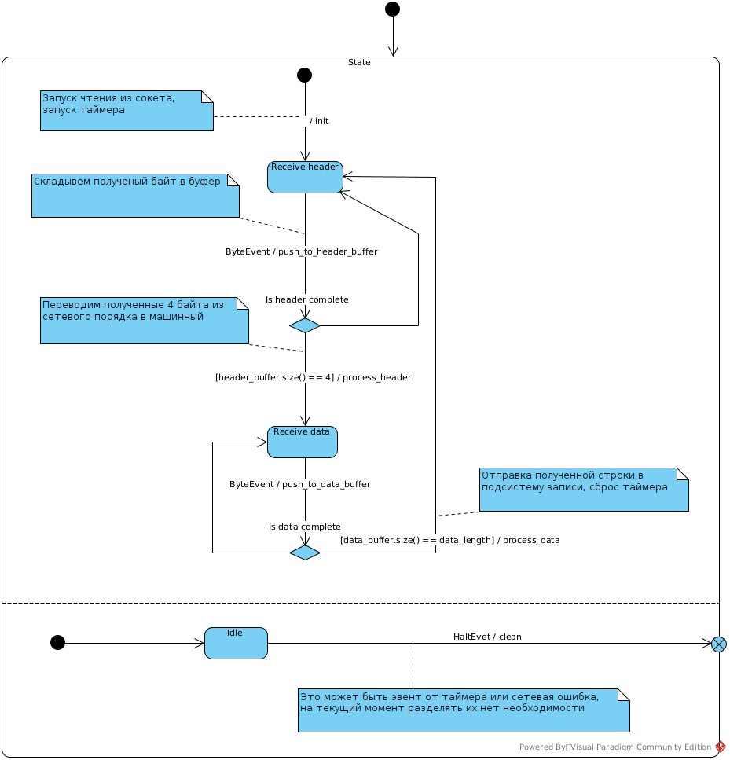
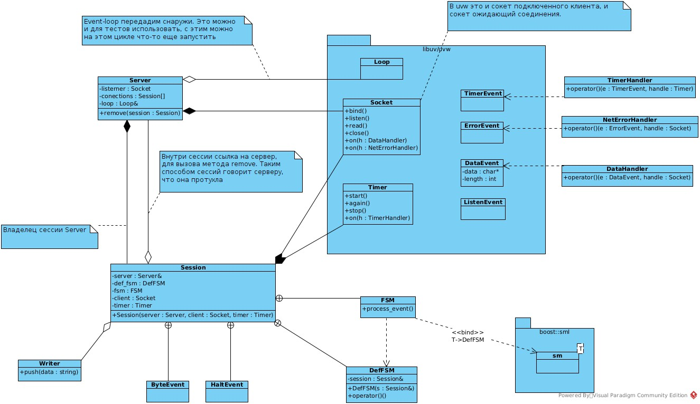

* Консольное приложение сервер, имеющее настроечный файл (IP, port), принимающий произвольное кол-во клиентов.
* От клиента принимать произвольную строчку, выводить на экран и записывать её в файл.
* Иметь сборочный скрипт CMakeList.txt.
* Возможность запустить сервер в докер контейнере(должен прилагаться Docker.file).
* Исходники выложить на Git(lab/hub).
* Все запускается под Linux.
* Исходные коды тестового задания можно будет выложить в открытый доступ, и можете использовать их по своему усмотрению.

---

* Общение через TCP
* Клиент может несколько строчек отправить.
* Формат пакета : |uint |строка| (первые 4 байта это длина строки, за ними идет сама строка)
* Если клиент в течении 20 секунд ничего не присылает, считать соединение мертвым и закрывать его.

---

Делать будем с использованием *state-машин*. Такую мелкую штуку можно и без них написать, но тогда переходы между состояниями и условия переходов будут тонким слоем размазаны по всему проекту. С машинами состояний переходы (transitions), условия (guards) и действия (actions) будут собраны в декларативные таблички. Заодно этот проект пригодится в качестве примера для статьи "Как я перестал боятся и полюбил конечные автоматы".

# Сессия

Машина состояний:



Структура сессии:



А теперь небольшое пояснение зачем такая странная конструкция сделана. Связка [uvw](https://github.com/skypjack/uvw), к которой обработчики отдельно прицепляются на *handle*-лы и state-машины позволила получить полностью декларативный код, все состояния и переходы между ними реализованы простой табличкой. В нем *ровно одно* ветвление: цикл для передачи в state-машину отдельных байтов. Если бы **uvw** позволяла по одному байту получать из сокета, то вообще без ветвлений получилось.

Реализация сессии:

```cpp
template <typename Server, typename Writer, typename Socket, typename Timer>
class Session : public SessionBase
{
public:
    Session(Server&, Writer&, std::shared_ptr<Socket>, std::shared_ptr<Timer>);

private:
    Server& server;
    Writer& writer;

    std::shared_ptr<Socket> client;
    std::shared_ptr<Timer> timer;


    std::string headerBuffer;
    std::uint32_t dataLength;
    std::string dataBuffer;

    void init();
    void pushToHeaderBuffer(char);
    bool isHeaderComplete() const;
    void processHeader();
    void pushToDataBuffer(char);
    bool isDataComplete() const;
    void processResult();
    void restart();
    void halt();

    struct DefFSM
    {
        explicit DefFSM(Session& s) : session{s} {}

        struct InitEvent {};
        struct ByteEvent { char byte; };
        struct HaltEvent {};

        auto operator()() const {

            auto init = [this] () { session.init(); };
            auto pushToHeaderBuffer = [this] (const ByteEvent& e) { session.pushToHeaderBuffer(e.byte); };
            auto isHeaderComplete = [this] () -> bool { return session.isHeaderComplete(); };
            auto processHeader = [this] () { session.processHeader(); };
            auto pushToDataBuffer = [this] (const ByteEvent& e) { session.pushToDataBuffer(e.byte); };
            auto isDataComplete = [this] () -> bool { return session.isDataComplete(); };
            auto processResult = [this] { session.processResult(); };
            auto restart = [this] { session.restart(); };
            auto halt = [this] { session.halt(); };

            using namespace boost::sml;

            return make_transition_table(
                *"Wait init"_s          + event<InitEvent> / init                     = "Receive header"_s,
                 "Receive header"_s     + event<ByteEvent> / pushToHeaderBuffer       = "Is header complete"_s,
                 "Is header complete"_s   [ !isHeaderComplete ]                       = "Receive header"_s,
                 "Is header complete"_s   [ isHeaderComplete  ]                       = "Process header"_s,
                 "Process header"_s                        / processHeader            = "Receive data"_s,
                 "Receive data"_s       + event<ByteEvent> / pushToDataBuffer         = "Is data complete"_s,
                 "Is data complete"_s     [ !isDataComplete ]                         = "Receive data"_s,
                 "Is data complete"_s     [ isDataComplete  ]                         = "Process result"_s,
                 "Process result"_s                        / (processResult, restart) = "Receive header"_s,

                *"In work"_s            + event<HaltEvent> / halt                     = X
            );
        }

        Session& session;
    };

    DefFSM defFsm;
    boost::sml::sm<DefFSM> fsm;
};


template <typename Server, typename Writer, typename Socket, typename Timer>
Session<Server, Writer, Socket, Timer>::Session(Server& s, Writer& w, std::shared_ptr<Socket> c, std::shared_ptr<Timer> t)
    :
      server{s},
      writer{w},

      client{std::move(c)},
      timer{std::move(t)},

      defFsm{*this},
      fsm{defFsm}
{
    auto dataHandler = [this] (const uvw::DataEvent& e, auto&) {
        for (std::size_t i = 0; i < e.length; i++) {
            typename DefFSM::ByteEvent byteEvent{e.data[i]};
            fsm.process_event(byteEvent);
        }
    };
    client->template on<uvw::DataEvent>(dataHandler);

    auto errorHandler = [this] (const uvw::ErrorEvent&, auto&) { fsm.process_event(typename DefFSM::HaltEvent{}); };
    client->template on<uvw::ErrorEvent>(errorHandler);

    auto timeoutHandler = [this] (const uvw::TimerEvent&, auto&) { fsm.process_event(typename DefFSM::HaltEvent{}); };
    timer->template on<uvw::TimerEvent>(timeoutHandler);

    fsm.process_event(typename DefFSM::InitEvent{});
}
```

Методы Session, которые дергает state-машина не показаны, почти все они однострочные и логики там нет, вся логика собрана *transition table*. Класс Session шаблонизирован для подстановки моков во время тестирования (статический полиморфизм).
