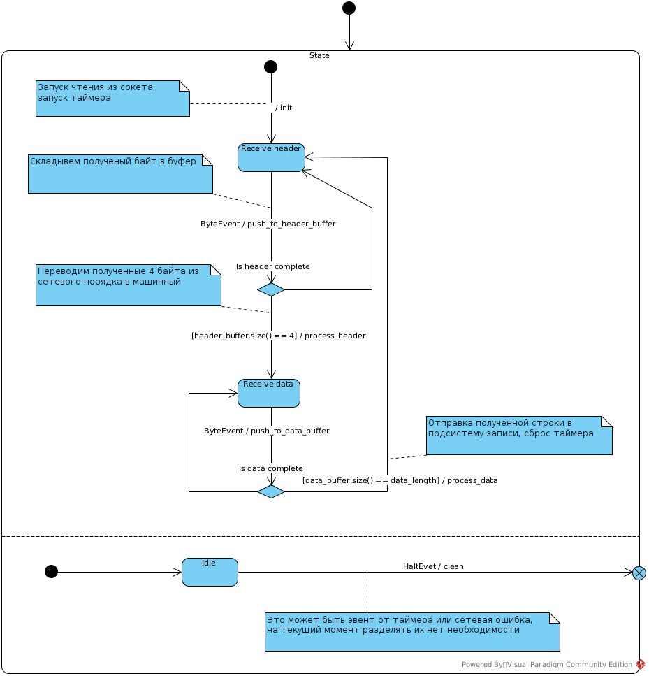

* Консольное приложение сервер, имеющее настроечный файл (IP, port), принимающий произвольное кол-во клиентов.
* От клиента принимать произвольную строчку, выводить на экран и записывать её в файл.
* Иметь сборочный скрипт CMakeList.txt.
* Возможность запустить сервер в докер контейнере(должен прилагаться Docker.file).
* Исходники выложить на Git(lab/hub).
* Все запускается под Linux.
* Исходные коды тестового задания можно будет выложить в открытый доступ, и можете использовать их по своему усмотрению.

---

* Общение через TCP
* Клиент может несколько строчек отправить.
* Формат пакета : |uint |строка| (первые 4 байта это длина строки, за ними идет сама строка)
* Если клиент в течении 20 секунд ничего не присылает, считать соединение мертвым и закрывать его.

---

Делать будем с использованием *state-машин*. Такую мелкую штуку можно и без них написать, но тогда переходы между состояниями и условия переходов будут тонким слоем размазаны по всему проекту. С машинами состояний переходы (transitions), условия (guards) и действия (actions) будут собраны в декларативные таблички. Заоодно этот проект пригодится в качестве примера для статьи "Как я перестал боятся и полюбил конечные автоматы".

# Сессия

Машина состояний:

